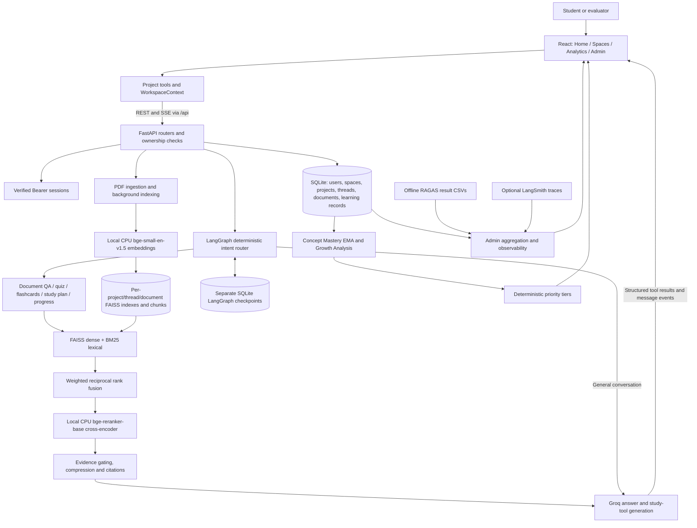

# StudyMate architecture and engineering decisions

This document describes the current implementation, including its limits. It is not a claim of production readiness. Setup and remaining deployment requirements are in [README.md](README.md).

## System overview



## Domain hierarchy and isolation

A user owns Spaces and Projects; a Space groups Projects by subject. A Project owns conversation Threads, Documents, quiz attempts, user-memory facts and concept-mastery records. Documents are associated with a thread and project; conversation checkpoints use thread IDs. Project scope is required on project APIs, with ownership verified through the authenticated user. Thread-history reads also verify ownership before reconstructing messages from checkpoints.

`app/api/dependencies.py` supplies `ProjectScope`; routers use project/thread/document ownership checks before calling services. Generated indexes live under `backend/vectorstores/` with project/thread/document scope. The database determines which index belongs to which document; indexes are not searched globally across users. Retrieval caches use index/query configuration to keep results associated with their source.

This separation makes the Project the learning boundary, while Spaces remain an organizational layer. Concept names are normalized within a project rather than merged across unrelated courses.

**Authentication boundary:** every application router is mounted behind verified Bearer-session authentication. Login/signup and API documentation are explicitly public; `/auth/me` and logout are protected. Missing, malformed, revoked or unrecognized credentials return 401 with a Bearer challenge. The session resolves to the authoritative backend user, including its current role; client-supplied role/user headers have no authority. Admin endpoints return 403 for authenticated non-admins. Default/demo identities cannot log in or reuse old sessions. Legacy ownership placeholders remain only when needed for migration, with no fresh demo/admin provisioning. Direct flashcard, planner and RAG-index requests additionally verify document ownership. Bearer sessions are server-issued and stored in the application database; the frontend retains its session locally. Passwords still use salted SHA-256, which needs replacement with an adaptive password hash for production.

## Ingestion, local embeddings and hybrid retrieval

`app/rag/ingest.py` parses PDFs into text with filename/page metadata and stable chunk identity. Defaults are 500-character chunks with 100-character overlap. Metadata and source references travel with retrieved chunks to support page-level citations. Document lifecycle states expose queued/indexing/ready/error behavior; startup recovers interrupted indexing.

The default embedding provider is local SentenceTransformers, **BAAI/bge-small-en-v1.5**, forced to CPU. Encoding is normalized, batched (default 32), and shares a process-level model instance between indexing and query retrieval. The remote NVIDIA implementation remains an optional compatibility path, not a required service.

Why local embeddings: ingestion no longer depends on a hosted embedding quota, network latency or an embedding credential. A small CPU model is more practical for a local evaluator setup. Costs move to model downloads, RAM and CPU time. This is not an entirely offline system: Groq still receives prompts and relevant context for generation.

FAISS supplies dense semantic candidates and BM25 supplies lexical candidates from stored chunks. Hybrid retrieval fuses ranked candidates using:

```text
RRF(document) = sum(weight / (60 + rank))
default weights: dense = 0.6, BM25 = 0.4
```

Hybrid search is enabled by the document-QA tool. The shared low-level retriever still has a dense-only default, and direct retrieval/evaluation paths can choose their mode. This distinction permits controlled dense-versus-hybrid comparisons.

Deduplication, optional query variants, metadata filtering/boosting and retrieval caching precede final ranking. A local **BAAI/bge-reranker-base** cross-encoder scores query/chunk pairs; the shared retrieval defaults return four reranked chunks from a requested top-six retrieval result set (callers can override). Raw reranker logits are converted to bounded relevance scores for evidence thresholds. Context compression and source citation formatting limit prompt size while retaining provenance. Insufficient evidence yields an explicit refusal/next step rather than an unsupported document answer; this reduces risk but does not guarantee zero hallucinations.

Why hybrid plus reranking: dense retrieval handles paraphrases; BM25 preserves exact terms and figure references; RRF combines incomparable score scales by rank; cross-encoding improves the final evidence order at the cost of CPU latency.

Index metadata records embedding compatibility. On a model switch, startup attempts to rebuild incompatible indexes from saved chunks; unrecoverable documents are marked for re-upload. Mixing vector dimensions/model spaces silently would yield invalid retrieval, so compatibility is checked explicitly.

## LangGraph agent and conversation memory

`app/agent/graph.py` defines an explicit state machine. The regex-based intent router chooses general chat, document QA, quiz, flashcard, study plan, progress or no-document branches. Tool execution proceeds through the graph's ToolNode and synthesis stage. Routing and scoped tool construction reduce ambiguous tool selection and avoid unnecessary routing-model calls.

ChatService streams structured tool results and assistant message events over SSE. The frontend uses these results to populate the existing quiz/deck/plan workspaces. A separate `langgraph_checkpoints.db` persists thread conversation state; the ORM database stores application metadata and learning records. This separation avoids coupling LangGraph's persistence schema to domain migrations. The history API reconstructs chronological human/assistant messages from the selected thread checkpoint. UI history fetches and late stream callbacks are isolated when switching conversations.

AI startup runs in a background initialization task: authentication remains available while models load. AI dependencies return a readable 503 until ready. The reranker is pre-warmed in a background thread. One process is a sensible initial deployment because model memory and SQLite/checkpointer concurrency need deliberate handling before horizontal scaling.

## Mastery, growth and recommendations

### Concept Mastery

`app/db/crud.py` updates project-scoped mastery for quiz topic/concept results:

```text
new_score = clamp(round(0.4 * session_pct + 0.6 * old_score, 2), 0, 100)
initial old_score = 50
```

Each update increments the attempt count and appends a snapshot to `concept_mastery_history`. For example, a first 100% session produces 70%, not instant 100% mastery. The EMA responds to recent work while retaining history. Mastery tiers are below 50 (needs attention), 50–under 75 (developing), and at least 75 (mastered). Flashcard feedback can create learning/weak-topic memory; it should not be described as the same quiz-EMA calculation.

The update uses the service/database transaction flow and a nested transaction; SQLite does not provide PostgreSQL-style row locks despite SQLAlchemy's `with_for_update()`. Multi-worker concurrency needs further validation.

### Growth Analysis

Growth uses chronological **EMA snapshots**, not raw quiz scores or a linear regression:

- Fewer than three snapshots: `insufficient_data`, delta is absent.
- Recent value: average of the latest two snapshots.
- At exactly three snapshots: baseline is the first snapshot.
- At four or more: baseline is the average of the two snapshots immediately preceding the latest two.
- Delta is rounded to two decimal places before classification: at least +5 points is `improving`; at most −5 is `requires_attention`; otherwise `stable`.

The three-snapshot threshold intentionally offers earlier guidance; four or more observations provide symmetric two-point windows. Flat progress and insufficient evidence are distinct states.

### Recommendations

`app/services/recommendations_service.py` combines mastery, growth and weak-topic memory with mutually exclusive first-match tiers:

1. **Regressing concept:** `requires_attention`, regardless of score.
2. **Critical gap:** mastery below 50, after regression is ruled out.
3. **Developing plateau/gap:** mastery 50–under 75 and either stable growth or a weak-topic fact.
4. **Specific remaining gaps:** mastered/improving concepts with weak-topic facts, excluding regression and candidates already captured by earlier tiers.
5. **Unassessed weak topic:** a weak-topic memory with no mastery record.

Candidates sort by priority, lower mastery score and more recent evidence; the project service defaults to three recommendations. Healthy progress without a weakness need not produce a recommendation. Mid-range concepts with insufficient history and no weak fact deliberately produce none.

Why deterministic rules rather than an LLM ranking: every recommendation has an inspectable trigger, consistent ordering and testable boundaries. Ranking adds no model latency or token cost and cannot invent evidence. The tradeoff is a fixed policy rather than open-ended pedagogical judgment.

## Analytics, evaluation and Admin

Global Analytics aggregates the user's project data, mastery, assessments, activity and study streaks. Project Analytics presents concept mastery, growth and recommendations from the same backend records. The frontend should not substitute example metrics for missing data.

Admin aggregates platform counts, activity filters, difficult concepts, engagement, user journeys, background ingestion and health checks. Admin routes check the current role on the authenticated backend user record.

`backend/eval/run_eval.py` runs the offline RAGAS harness with a matching PDF and YAML reference dataset. It uses a Groq generator plus a Groq judge (the current judge is configured in code as `openai/gpt-oss-120b`), local embeddings and optional dense/hybrid retrieval. Standard cases measure faithfulness, answer relevancy, context precision and context recall; adversarial cases use faithfulness and refusal checks. Separate generator/judge keys can reduce shared rate-limit contention. Model names alone do not guarantee evaluator independence, so reported scores should be interpreted with the dataset and model configuration.

Admin parses saved `eval_results_dense.csv` then `eval_results_hybrid.csv`, using the first readable nonempty file. It is **not** a live or automatically latest-run evaluation and does not compare both files simultaneously. Missing evidence is represented as unavailable, not perfect quality.

Optional LangSmith telemetry uses `LANGCHAIN_API_KEY`, `LANGCHAIN_TRACING_V2` and `LANGCHAIN_PROJECT` in the Admin adapter. Without configured tracing, the service falls back to local application evidence; it cannot claim measured external token/cost traces it did not receive.

## Frontend and persistence decisions

React 19/Vite uses App routes for Home, Spaces, Analytics, Admin and project tools. AuthContext manages the server session; WorkspaceContext manages the active project/thread and study-tool payloads. Shared AppNavigation keeps the global sidebar consistent. ProjectWorkspace composes project navigation, breadcrumbs and WorkspaceRouter; the latter keeps tool panels mounted and hides inactive ones to preserve working state.

The presentation uses Tailwind utilities, Lucide icons and scoped `project-theme.css`; quizzes, flashcards and plans use the available desktop width. Generated content and setup forms share the palette. This UI work does not introduce new mobile behavior. Form/deck/plan working state is not equivalent to durable backend persistence: component-held checklists and study interactions should not all be described as surviving a reload.

SQLite was chosen for a small, easy-to-run evaluator installation with relational constraints and low operational overhead. Startup creates a fresh schema without a usable default account, so a developer database need not ship. Automatic legacy migrations preserve older records. Uploaded material, FAISS files and runtime databases remain local and ignored; source code and migration scripts remain versioned.

Production deployment additionally needs secure administrator provisioning and password storage, consistent backups, persistent storage, SSE proxy configuration, secret management and a reviewed scaling strategy. These are open deployment requirements, not implemented infrastructure.
