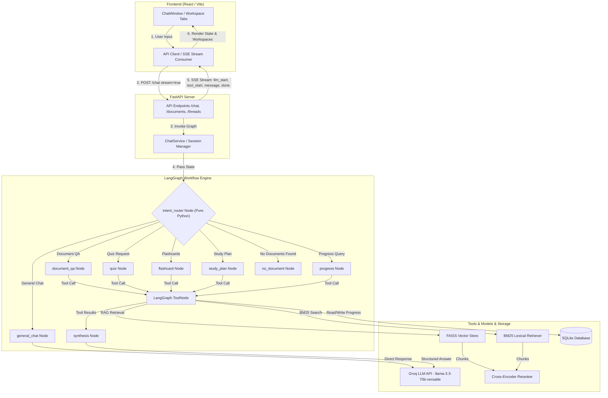
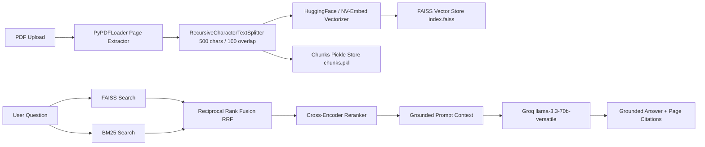

# 🎓 StudyMate

[](https://fastapi.tiangolo.com)
[](https://langchain-ai.github.io/langgraph/)
[](https://react.dev)
[](https://groq.com)
[](https://opensource.org/licenses/MIT)

**StudyMate** is a production-style, document-grounded AI study workspace designed for students, educators, and researchers. By combining **FastAPI**, **LangGraph state machine workflows**, a **pure-Python deterministic intent router**, and a **hybrid dense/lexical RAG pipeline (FAISS + BM25 + Cross-Encoder Reranking)**, StudyMate converts course material PDFs into an interactive study environment. It delivers zero-hallucination academic document Q&A with page-level citations, automated 4-option quiz generation, memory flashcards, multi-day study planners, and personalized student progress tracking streamed live over Server-Sent Events (SSE).

---

## 🚀 Features

### 🧠 AI Features
- **Document Question Answering**: Grounded academic Q&A referencing uploaded PDFs with source file and page citations.
- **Hybrid RAG Pipeline**: Dense FAISS vector retrieval combined with lexical BM25 keyword matching fused via Reciprocal Rank Fusion (RRF).
- **Cross-Encoder Reranking**: Two-stage reranking using `sentence-transformers/ms-marco-MiniLM-L-6-v2` with calibrated sigmoid scoring thresholds.
- **Deterministic Intent Routing**: Pure-Python regex routing (zero LLM token latency) prioritizing student intent before any LLM model binding.
- **Single-Tool Isolation**: Binds at most one tool per graph node, eliminating open-weights LLM tool-calling failure modes.
- **Automated Quiz Generation**: Generates 4-option multiple-choice quizzes with answer keys and detailed explanations.
- **Flashcard Deck Creation**: Extracts core term/definition pairs into flip-card study sets.
- **Study Plan Roadmaps**: Automatically builds multi-day study schedules leading up to exams.
- **Progress & Weakness Tracking**: Stores student performance, quiz scores, and weak topics across sessions.
- **No-Document Short-Circuit**: Protects against wasted LLM API calls when asking document queries in empty threads.

### ⚡ Backend Features
- **FastAPI Core**: Async non-blocking API routing with Pydantic v2 data validation and OpenAPI doc generation.
- **LangGraph State Workflows**: State machine orchestration (`AgentState`) with clear conditional edges and synthesis nodes.
- **LangGraph Memory Checkpointer**: In-memory `MemorySaver` checkpointer for thread turn-history restoration.
- **SQLite WAL Mode**: Relational storage for threads, document provenance, study logs, user memory, and quiz attempt scores.
- **Real-Time SSE Streaming**: Emits named execution events (`llm_start`, `tool_start`, `tool_end`, `message`, `done`) over HTTP chunked streaming.
- **Groq API Resilience**: Automatic Hermes text function-call parser fallback for open-weights models.

### 🎨 Frontend Features
- **Modern React (Vite)**: Component-driven interface built with Tailwind CSS, lucide icons, and responsive layouts.
- **Interactive Chat Interface**: Renders markdown content, inline code snippets, typing animations, and source page badges.
- **Dedicated Workspaces**: Multi-tab drawer rendering interactive Quiz, Flashcards, Study Planner, and Activity Log panels.
- **Document Management**: Drag-and-drop PDF uploader with indexed page and chunk counts.
- **Real-Time Status Badges**: Displays dynamic progress indicators ("Searching documents...", "Generating quiz...", "Fetching progress...").
- **Stream Lifecycle Protection**: Stream cancellation (`reader.cancel()`) preventing endless loading spinners.

---

## 🏗 Architecture



---

## 🛠 Tech Stack

| Domain | Technologies Used |
|---|---|
| **Frontend** | React 19, Vite, Tailwind CSS, JavaScript (ES6+) |
| **Backend** | Python 3.12, FastAPI, Uvicorn, Pydantic v2 |
| **AI Orchestration** | LangGraph, LangChain Core |
| **LLM Provider** | Groq API (`llama-3.3-70b-versatile`) |
| **Embeddings** | HuggingFace / NVIDIA Embeddings (`all-MiniLM-L6-v2`) |
| **Vector Store** | FAISS (Facebook AI Similarity Search) |
| **Lexical Search & Reranking** | BM25 (`langchain_community`), SentenceTransformers Cross-Encoder (`ms-marco-MiniLM-L-6-v2`) |
| **Database** | SQLite (WAL Mode) via SQLAlchemy 2.0 ORM |
| **Streaming** | Server-Sent Events (SSE) via `StreamingResponse` |
| **Testing** | Pytest |

---

## 📂 Project Structure

```text
StudyMate/
├── backend/
│   ├── app/
│   │   ├── agent/
│   │   │   ├── nodes/
│   │   │   │   └── chatbot.py          # Node factories (general_chat, document_qa, quiz, etc.)
│   │   │   ├── graph.py                # LangGraph StateGraph topology and edges
│   │   │   ├── intent_router.py        # Pure-Python intent classification engine
│   │   │   ├── llm.py                  # ChatGroq model configurations
│   │   │   ├── prompts.py              # System prompts for QA, quizzes, and memory
│   │   │   └── state.py                # AgentState TypedDict schema
│   │   ├── api/
│   │   │   ├── chat.py                 # POST /chat SSE streaming route
│   │   │   ├── documents.py            # PDF upload and deletion endpoints
│   │   │   ├── rag.py                  # Standalone RAG debug query route
│   │   │   ├── routes_quiz.py          # Quiz creation and scoring endpoints
│   │   │   ├── routes_flashcards.py    # Flashcard generation endpoints
│   │   │   ├── routes_planner.py       # Study plan endpoints
│   │   │   ├── routes_progress.py      # Student performance & progress APIs
│   │   │   └── threads.py              # Thread lifecycle & message history routes
│   │   ├── db/
│   │   │   ├── crud.py                 # Database CRUD functions
│   │   │   ├── models.py               # ORM models (Thread, Document, StudyLog, UserMemory)
│   │   │   └── session.py              # SQLite engine & WAL session manager
│   │   ├── rag/
│   │   │   ├── ingest.py               # PyPDFLoader + RecursiveCharacterTextSplitter
│   │   │   ├── reranker.py             # Cross-Encoder MiniLM reranking
│   │   │   ├── retriever.py            # FAISS + BM25 RRF hybrid retriever
│   │   │   └── store.py                # FAISS vector store & chunk persistence
│   │   ├── schemas/                    # Pydantic request & response schemas
│   │   ├── services/                   # Business logic services (ChatService, ThreadService)
│   │   ├── tools/                      # Tool implementations (rag_tool, memory_tool, etc.)
│   │   └── main.py                     # FastAPI application lifespan & routing
│   └── tests/
│       └── test_intent_router.py       # 73 Pytest regression tests
├── frontend/
│   ├── src/
│   │   ├── api/client.js               # REST API fetch client
│   │   ├── components/                 # React UI components and workspaces
│   │   │   ├── workspace/              # Quiz, Flashcard, and Planner Workspaces
│   │   │   ├── ChatWindow.jsx          # Message stream feed & input container
│   │   │   └── DocumentPanel.jsx       # PDF upload dropzone
│   │   ├── lib/api.js                  # SSE ReadableStream consumer
│   │   └── App.jsx                     # Top-level React container layout
│   └── vite.config.js                  # Vite dev server & proxy settings
├── PROJECT_ARCHITECTURE.md              # Exhaustive technical engineering documentation
└── README.md
```

---

## ⚙️ Installation

### 1. Clone Repository
```bash
git clone https://github.com/your-username/StudyMate.git
cd StudyMate
```

### 2. Backend Setup
```bash
cd backend

# Create virtual environment
python -m venv .venv

# Activate environment (Windows)
.venv\Scripts\activate
# Activate environment (macOS/Linux)
# source .venv/bin/activate

# Install dependencies
pip install -r requirements.txt

# Run FastAPI server
uvicorn app.main:app --reload
```
The backend API will run at `http://127.0.0.1:8000`.

### 3. Frontend Setup
```bash
cd ../frontend

# Install dependencies
npm install

# Start Vite development server
npm run dev
```
The application UI will open at `http://localhost:5173`.

---

## 🔑 Environment Variables

Create a `.env` file inside the `backend/` directory:

| Variable | Description | Required | Example |
|---|---|---|---|
| `GROQ_API_KEY` | Groq LLM API Key for general chat and RAG synthesis | **Yes** | `gsk_...` |
| `GROQ_QUIZ_API_KEY` | Groq API Key dedicated for quiz and plan generation | **Yes** | `gsk_...` |
| `GROQ_MODEL` | Default LLM model identifier | **Yes** | `llama-3.3-70b-versatile` |
| `DATABASE_URL` | SQLAlchemy database URL | Optional | `sqlite:///backend/chatbot.db` |
| `LANGCHAIN_TRACING_V2` | Enable LangSmith tracing | Optional | `true` |
| `LANGCHAIN_API_KEY` | LangSmith API Key | Optional | `lsv2_pt_...` |

---

## 📖 How It Works

1. **User Query**: The student submits a message in `ChatWindow.jsx`.
2. **HTTP Stream Request**: Frontend invokes `sendChatMessageStream()` issuing a `POST /chat` request with `stream=true`.
3. **Intent Classification**: The request hits `app.agent.intent_router.classify_intent()`. A pure-Python regex classifier categorizes intent (`PROGRESS`, `QUIZ`, `FLASHCARD`, `STUDY_PLAN`, `GENERAL_CHAT`, or `DOCUMENT_QA`).
4. **No-Document Guard**: If intent requires a document but none exists in the thread, intent is overridden to `NO_DOCUMENT`, immediately returning a helpful warning without invoking model APIs.
5. **Node Execution**: LangGraph executes the matching node:
   - `document_qa` node binds `search_uploaded_documents`.
   - `quiz` node binds `generate_document_quiz`.
   - `progress` node binds `get_study_progress`.
6. **Tool Execution**: `ToolNode` executes the tool. For RAG, it runs parallel FAISS L2 + BM25 retrieval, fuses scores with RRF, reranks top chunks via Cross-Encoder, and formats `[SOURCE:N]` context.
7. **Synthesis**: The `synthesis` node receives context, applies the intent-specific system prompt, and condition-generates the grounded response.
8. **SSE Delivery**: `StreamingResponse` streams named events (`llm_start`, `tool_start`, `message`, `done`) with anti-buffering headers.
9. **UI Render**: React consumes events, displays status badges ("Searching documents...", "Generating quiz..."), renders assistant text with clickable PDF source citations, and updates workspace tabs.

---

## 🧠 Intent Routing

StudyMate implements **deterministic, pre-LLM intent routing** instead of relying on LLMs to route requests:

```text
Priority: PROGRESS > QUIZ > FLASHCARD > STUDY_PLAN > GENERAL_CHAT > (Default: DOCUMENT_QA)
```

### Why Deterministic Routing?
- **Zero Latency**: Classification runs in `<1ms` in pure Python instead of waiting 300--800ms for an LLM API roundtrip.
- **Zero Token Cost**: No LLM token usage for intent classification.
- **Single-Tool Isolation**: Prevents LLM function-calling failure modes by presenting the model with at most one tool per turn.
- **Deterministic Testing**: Enables 100% reproducible unit tests without mocking remote LLM calls.

---

## 📄 RAG Pipeline



1. **Upload & Clean**: PDF bytes are parsed via `PyPDFLoader`. Metadata is sanitized to prevent local path leaks.
2. **Chunking**: Text is split into 500-character chunks with 100-character overlap via `RecursiveCharacterTextSplitter`.
3. **Hybrid Indexing**: Vector embeddings are saved to `index.faiss`. Raw chunks are pickled to `chunks.pkl` for BM25 term frequency indexing.
4. **Hybrid Retrieval**: Runs FAISS L2 dense search and BM25 lexical search in parallel, merging candidate ranks via Reciprocal Rank Fusion (RRF).
5. **Reranking**: `sentence-transformers/ms-marco-MiniLM-L-6-v2` Cross-Encoder scores candidates, applying a `sigmoid(logit)` score threshold to prune low-relevance noise.
6. **Citation Formatting**: Context is injected into `GROUNDED_ANSWER_SYSTEM_PROMPT` using `[SOURCE:N]` markers. `extract_citations_from_messages` maps citations to document filenames and 1-based page numbers.

---

## 📷 Screenshots

| Interface | Preview |
|---|---|
| **Chat & Grounded Q&A** | *Interactive conversation feed with page citation badges* |
| **PDF Document Panel** | *Drag-and-drop document upload and list view* |
| **Quiz Workspace** | *Interactive 4-option multiple-choice quizzes with instant grading* |
| **Flashcard Workspace** | *Flip-card study decks extracted from course material* |
| **Study Planner** | *Multi-day exam preparation schedule and task breakdown* |
| **Study Log & Progress** | *Student activity timeline and weak topic analytics* |

---

## 🧪 Testing

StudyMate features an automated Pytest regression test suite covering 73 test cases:

```bash
cd backend
.venv\Scripts\python.exe -m pytest tests/test_intent_router.py -v
```

```text
============================= 73 passed in 38.12s =============================
```

### Tested Scenarios
- **General Chat**: Greetings, identity queries ("my name is santhu", "who are you"), small talk.
- **Document QA Fallback**: Subject-matter queries ("explain gradient descent", "what is recursion") defaulting to `DOCUMENT_QA`.
- **Tool Intent Matches**: Quiz, Flashcards, Study Plan, and Progress phrasings.
- **Typo Tolerance**: Handled typos like `"what i am week at"` routing to `PROGRESS`.
- **No-Document Short-Circuit**: Verified intent override to `NO_DOCUMENT` when threads contain zero uploaded PDFs.

---

## 📈 Future Improvements

- [ ] **OCR Ingestion Pipeline**: Integrate Tesseract / Unstructured for scanned image-only PDFs.
- [ ] **Multi-Document Cross-Reasoning**: Synthesize insights across multiple uploaded textbooks simultaneously.
- [ ] **Adaptive Quiz Generation**: Automatically construct quizzes targeting weak topics identified in `UserMemory`.
- [ ] **Pgvector & Qdrant Support**: Production vectorstore backend migration options.
- [ ] **Background Task Queue**: Offload PDF processing and vector index generation to Celery / Redis workers.

---

## 🤝 Contributing

Contributions are welcome! Follow these steps to contribute:

1. Fork the repository.
2. Create a feature branch (`git checkout -b feature/amazing-feature`).
3. Commit your changes (`git commit -m 'Add amazing feature'`).
4. Push to the branch (`git push origin feature/amazing-feature`).
5. Open a Pull Request.

---

## 📜 License

Distributed under the **MIT License**. See `LICENSE` for more information.

---

## 👨‍💻 Author

**StudyMate Engineering Team**

- **GitHub**: [github.com/your-username](https://github.com/your-username)
- **LinkedIn**: [linkedin.com/in/your-profile](https://linkedin.com/in/your-profile)
- **Email**: `contact@studymate.ai`
- **Architecture Spec**: [`PROJECT_ARCHITECTURE.md`](PROJECT_ARCHITECTURE.md)
