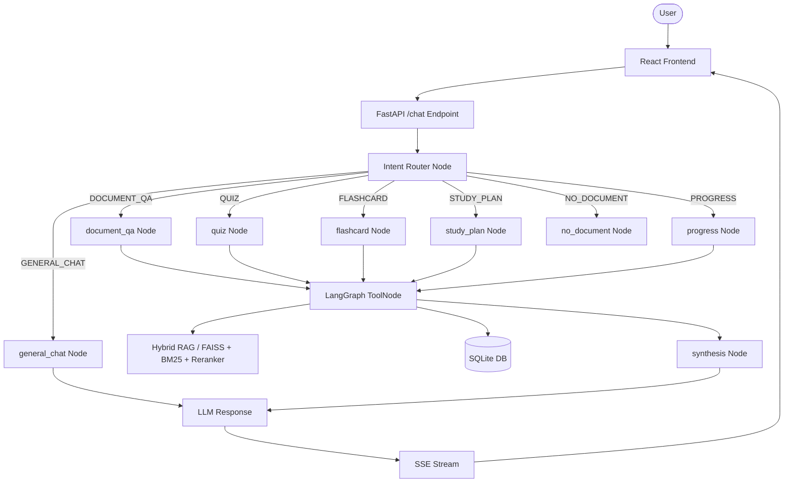

# StudyMate

StudyMate is a contextual AI study workspace that transforms course material PDFs into an interactive learning environment. It enables students to ask document-grounded questions with page-level citations, generate multiple-choice quizzes, build flashcard study decks, schedule exam prep plans, and track progress over time. The application is built using FastAPI, LangGraph, React, and a hybrid RAG pipeline (FAISS + BM25 + Cross-Encoder reranking).

---

## Features

### AI Features
- **Document Q&A using RAG**: Grounded academic answers referencing uploaded PDFs with source file and page citations.
- **Deterministic Intent Routing**: Pure-Python regex classification that routes queries before LLM tool binding.
- **Quiz Generation**: Generates 4-option multiple-choice quizzes with answer keys and detailed explanations.
- **Flashcard Generation**: Extracts core term and definition pairs into interactive study decks.
- **Study Plan Generation**: Constructs multi-day study schedules leading up to exams based on document topics.
- **Study Progress Tracking**: Records weak topics, studied concepts, and quiz scores across sessions.
- **Persistent Conversation Memory**: Thread checkpointing via LangGraph alongside SQLite user memory tables.
- **Streaming Responses**: Delivers text responses and named execution events over Server-Sent Events (SSE).

### Backend
- **FastAPI**: Non-blocking async endpoints with Pydantic v2 data validation and automatic OpenAPI documentation.
- **LangGraph Workflow**: State machine graph (`AgentState`) with single-tool node isolation and post-tool synthesis.
- **SQLite**: Relational persistence (WAL mode) for threads, document provenance, study logs, and quiz scores.
- **Modular Services**: Decoupled architecture separating API handlers, business services, RAG logic, and DB CRUD.
- **REST APIs**: Endpoints for thread management, document uploads, quiz scoring, and progress tracking.

### Frontend
- **React**: Modern SPA interface built with Vite and Tailwind CSS.
- **Chat Interface**: Streamed message feed with markdown rendering, inline code blocks, and source page badges.
- **PDF Upload**: Drag-and-drop document upload interface with indexed page and chunk status.
- **Real-Time Streaming UI**: Live progress indicators (`Searching documents...`, `Generating quiz...`) with stream cancel protection.

---

## Architecture



StudyMate routes every incoming user query through a pure-Python intent router before any LLM model binding occurs. Based on the classified intent, the state machine branches to a dedicated graph node that binds at most one tool, avoiding model function-calling failures. Tool outputs are processed by a synthesis node and streamed back to the client over SSE.

---

## Tech Stack

| Layer | Technologies |
|---|---|
| **Frontend** | React 19, Vite, Tailwind CSS |
| **Backend** | Python 3.12, FastAPI, Uvicorn, Pydantic v2 |
| **AI & Orchestration** | LangGraph, LangChain Core, Groq API (`llama-3.3-70b-versatile`) |
| **RAG Pipeline** | FAISS, BM25 (`langchain_community`), Cross-Encoder (`ms-marco-MiniLM-L-6-v2`) |
| **Database** | SQLite (WAL Mode) via SQLAlchemy 2.0 ORM |
| **Streaming** | Server-Sent Events (SSE) via `StreamingResponse` |
| **Testing** | Pytest |

---

## Project Structure

```text
StudyMate/
├── backend/
│   ├── app/
│   │   ├── agent/       # LangGraph state machine, nodes, and intent router
│   │   ├── api/         # FastAPI router endpoints and dependencies
│   │   ├── db/          # SQLAlchemy ORM models, session setup, and CRUD operations
│   │   ├── rag/         # Document ingestion, FAISS/BM25 retrieval, and reranking
│   │   ├── schemas/     # Pydantic request and response schemas
│   │   ├── services/    # Business logic services for chat, threads, and documents
│   │   ├── tools/       # LangChain tools for RAG, memory, quiz, flashcards, and plans
│   │   └── main.py      # FastAPI application entrypoint and lifespan context
│   └── tests/           # Pytest unit and regression test suite
├── frontend/
│   ├── src/
│   │   ├── api/         # REST API fetch helpers
│   │   ├── components/  # Chat window, document panel, and workspace tab components
│   │   ├── lib/         # SSE stream reader consumer
│   │   └── App.jsx      # Root application layout
│   └── vite.config.js   # Vite dev server and proxy configuration
└── PROJECT_ARCHITECTURE.md # Full technical specification document
```

---

## Getting Started

### Prerequisites
- Python 3.12+
- Node.js 18+

### Backend Setup

```bash
cd backend
python -m venv .venv

# Windows
.venv\Scripts\activate
# macOS/Linux: source .venv/bin/activate

pip install -r requirements.txt
uvicorn app.main:app --reload
```

### Frontend Setup

```bash
cd frontend
npm install
npm run dev
```

### Environment Variables

Create a `.env` file in the `backend/` directory:

```env
GROQ_API_KEY=gsk_...
GROQ_QUIZ_API_KEY=gsk_...
GROQ_MODEL=llama-3.3-70b-versatile
DATABASE_URL=sqlite:///backend/chatbot.db
```

---

## How It Works

```text
User Input → React Frontend → POST /chat → Intent Router → LangGraph Node → Tool (if needed) → LLM → SSE Stream → React UI
```

1. **User Request**: The user sends a chat query from the React interface.
2. **Intent Classification**: The backend runs `intent_router` (pure-Python regex) to classify intent before calling LLM APIs.
3. **Graph Execution**: The graph routes to the node corresponding to the intent (`document_qa`, `quiz`, `flashcard`, `study_plan`, `progress`, `general_chat`, or `no_document`).
4. **Tool Execution**: If a tool is required, `ToolNode` executes it (e.g. hybrid FAISS + BM25 retrieval for document Q&A or reading SQLite progress for performance questions).
5. **Synthesis & Streaming**: The `synthesis` node conditions the final answer, which is streamed over SSE using named events (`llm_start`, `tool_start`, `message`, `done`) back to the frontend.

---

## Testing

StudyMate includes an automated Pytest regression test suite for intent routing and priority fallback logic.

To run the tests:

```bash
cd backend
.venv\Scripts\python.exe -m pytest tests/test_intent_router.py -v
```

The test suite covers 73 scenarios including greetings, document Q&A defaults, quiz/flashcard phrasings, progress queries, typos, and empty-thread short-circuiting.

---

## Future Improvements

- Add Tesseract / Unstructured OCR support for scanned image-only PDFs.
- Enable cross-document synthesis across multiple active PDFs in a single thread.
- Implement adaptive quiz generation based on weak topics stored in `UserMemory`.
- Migrate vector storage from local FAISS to Qdrant or Pgvector.
- Offload document processing and vector indexing to Celery / Redis background workers.
- Add multi-tenant user authentication and authorization.

---

## License

This project is licensed under the [MIT License](LICENSE).

---

## Author

- **GitHub**: [Gayathri-b-06](https://github.com/Gayathri-b-06)
- **Architecture Documentation**: [`PROJECT_ARCHITECTURE.md`](PROJECT_ARCHITECTURE.md)
